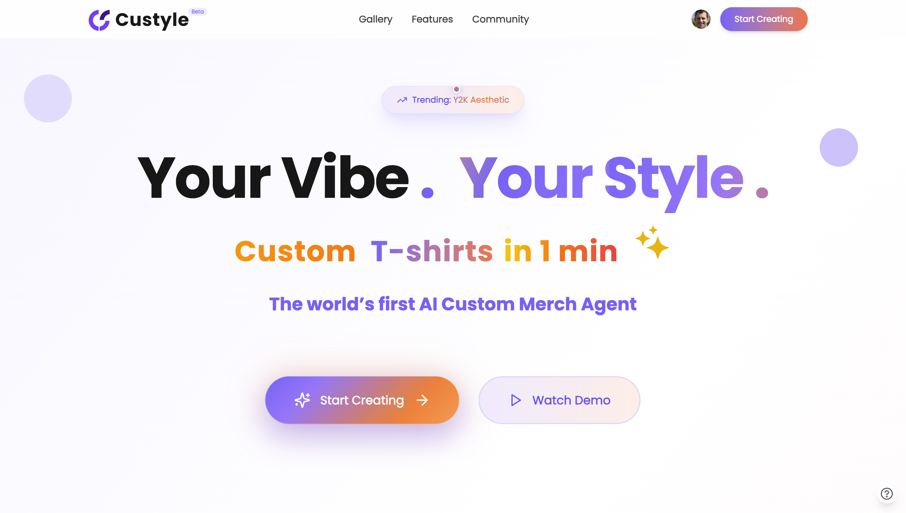
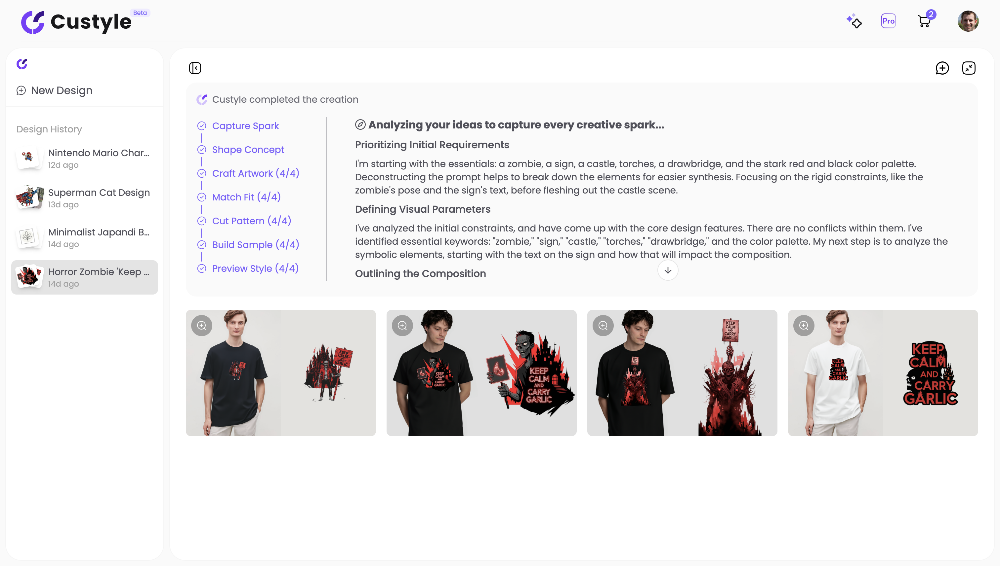

# 👕 Custyle — The World’s First AI Custom MerchAgent™

🚀 **Custyle turns creativity into merch in minutes.**  
**Type a prompt, drop an image, or spark an idea** → Custyle’s **AI MerchAgent™** generates unique **T-shirt, hoodies, and tote bags to posters and phone cases** designs, previews them on realistic AI models, and connects instantly to production.  
**No design skills. No barriers. Just your vibe — made wearable.**  

---

## ✨ Why Custyle?

- 🧠 **AI MerchAgent™ co-pilot** — Co-creates with you, learns your vibe, and refines with feedback.
- 💬 **Create by chat or upload** — Turn prompts/photos into **multiple print-ready variations** in minutes.
- 👀 **See it before you make it** — **Archetype-matched AI models** + studio-grade mockups for folds, fit, and fabric.
- 🔁 **End-to-end, no friction** — Inspiration → design → mockup → **try-on** → publish. No design tools required.
- 🚚 **On-demand production** — Connected to **Printful/Printify** for fast global fulfillment; wear, share, or **sell**.
- 🧢 **More than tees** — T-shirts, hoodies, caps, totes, posters, phone cases, and more.
 

---

## 🔑 What Makes Custyle Different?

- ⏱ **From idea to merch in minutes** — No tools, no barriers, just instant creation.  
- 👩‍🎤 **Gen-Z first** — Built for self-expression, not logo-chasing mass fashion.  
- 🌐 **AI × C2M synergy** — AI-generated designs flow directly into on-demand supply chains for global fulfillment.  
- 🔄 **UGC-driven commerce** — Every user can be a designer, buyer, and seller in the same loop.  

---

## 🌟 How It Works

1. 📝 **Input Your Idea** → Chat, drop a photo, or spark an idea.  
2. 🎨 **AI Creates Variations** → Multi-agent AI generates multiple **print-ready designs** in seconds.  
3. 👕 **Preview on Models** → See **studio-grade try-ons** with archetype-matched AI models.  
4. 🛒 **Make It Real** → Export, publish, wear, or **sell** your custom merch instantly.  

⭐ **Custyle: Your Vibe. Your Style. Your Merch.**

---

## 🖼️ Screenshots & Demo

### 1. Homepage – Custyle at a glance

### 2. Create with AI – Start from a prompt or photo

### 3. Interactive Design Process – Explore multiple variations

### 4. From Idea to Merch – Try-on & final merch ready to ship

---

## 📖 About Custyle

Custyle = **AI + C2M** → Personalized Merch at Scale.  
We believe the future of retail is **personalized, experience-driven, and AI-powered.**  

Custyle is building the next-generation consumer platform where anyone can be both a **creator and a consumer** — turning imagination into merch at global scale.  

🌍 [Official Website →](https://custyle.ai)  
💬 [Join Discord →](https://discord.gg/7B52gKXx)  
🐦 [Follow on Twitter →](https://x.com/custyleai)  
📷 [See on Instagram →](https://www.instagram.com/custyle.ai)  

---

## 📌 Roadmap

- ✅ **Step 1: MVP Launch** — AI-powered T-shirt creation (completed)  
- 🚀 **Step 2: Expand Catalog** — From tees to **hoodies, caps, totes, posters, and phone cases**  
- 🔌 **Step 3: Open API** — Empower creators & brands with APIs for design, try-on, and fulfillment  
- 🌍 **Step 4: Global Ecosystem** — Custyle as an open platform for creators, consumers, and supply chains worldwide  
 

---

## ⭐ Support
If you believe in **personalization as the future of retail**, please give this repo a ⭐ — it helps more people discover Custyle!  
